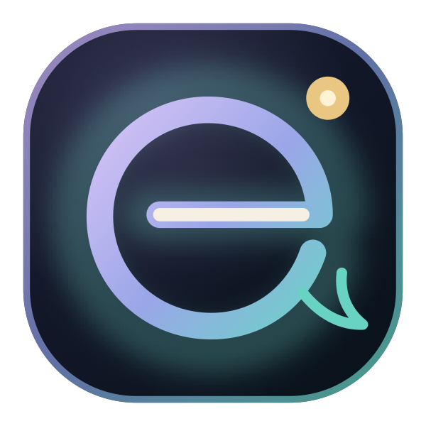

<div align="center">
  

  <h1>AI Companion</h1>

  <a href="https://git.io/typing-svg">
    
  </a>

  <p>
    A polished FastAPI web app for personal AI companionship, emotional check-ins,
    anonymous community sharing, animated companion profiles, and local voice generation.
  </p>

  <p>
    
    
    
    
  </p>
</div>

---

## Companion Experience Preview

<div align="center">
  
  <br />
  <sub>Scene preview. The actual companion characters are loaded from VRM model files inside the app.</sub>
</div>

## Companion Characters

| Character | Model file | Scene assets |
| --- | --- | --- |
| Yuna | `app/static/images/companions/female-yuna.vrm` | `bg-yuna-cherry.jpg`, `emora-room-bg.jpg` |
| Haru | `app/static/images/companions/male-haru.vrm` | `bg-haru-forest.jpg` |
| Robert | `app/static/images/companions/robert.vrm` | `emora-room-bg.jpg` |
| Rose | `app/static/images/companions/rose.vrm` | `bg-sakurada-garden.jpg` |

## What Makes It Shine

| Experience | Details |
| --- | --- |
| Personal companion chat | OpenAI-compatible responses with conversation history and saved sessions. |
| Emotional dashboard | Pin, delete, share, and revisit conversations from a focused workspace. |
| Anonymous community | MongoDB-backed community posts with likes and user privacy in mind. |
| Secure auth flow | Register, login, JWT sessions, Google OAuth, and OTP password reset. |
| VRM companion characters | Yuna, Haru, Robert, and Rose are loaded as `.vrm` character models in the app. |
| Voice pipeline | Piper TTS integration with cached WAV generation and companion voice mapping. |

## Tech Stack

```text
FastAPI       Web server and API routes
Jinja2        Server-rendered pages
MongoDB       Users, conversations, community posts, OTP records
OpenAI SDK    OpenAI-compatible chat completions
Google Auth   OAuth sign-in support
Piper TTS     Local companion voice generation
Vanilla JS    Page behavior and dashboard interactions
CSS           Custom polished UI styling
```

## Project Structure

```text
AI-Companion-/
  app/
    main.py                 FastAPI app entrypoint
    config.py               Environment-backed settings
    database.py             MongoDB client and indexes
    security.py             Passwords, JWTs, auth helpers
    routers/                Auth, chat, pages, posts, voices
    services/               OpenAI, Google auth, community logic
    templates/              Jinja pages
    static/                 CSS, JS, logos, avatars, VRM models, scene assets
  scripts/
    voice_downloader.py     Optional Piper voice model downloader
  .env.example              Safe environment template
  requirements.txt          Python dependencies
```

## Quick Start

```bash
python3 -m venv .venv
source .venv/bin/activate
pip install -r requirements.txt
cp .env.example .env
```

Update `.env` with your MongoDB URI, JWT secret, auth credentials, and model settings.

```bash
uvicorn app.main:app --reload --host 127.0.0.1 --port 8000
```

Open:

```text
http://127.0.0.1:8000
```

## Environment Setup

Important values from `.env.example`:

| Variable | Purpose |
| --- | --- |
| `MONGO_URI` | MongoDB connection string. |
| `JWT_SECRET` | Secret used to sign access tokens. |
| `OPENAI_API_KEY` | API key for OpenAI-compatible chat. |
| `OPENAI_BASE_URL` | Optional compatible endpoint, such as GitHub Models or Azure inference. |
| `OPENAI_MODEL` | Chat model name, defaults to `gpt-4o` in the template. |
| `GOOGLE_CLIENT_ID` | Google OAuth web client ID. |
| `GOOGLE_CLIENT_SECRET` | Google OAuth client secret for callback flow. |
| `EMAIL_USER` / `EMAIL_PASS` | SMTP credentials for OTP password reset emails. |

## Google OAuth

For local development, configure your Google OAuth web client with:

```text
Authorized JavaScript origin: http://127.0.0.1:8000
Authorized redirect URI:       http://127.0.0.1:8000/auth/google/callback
```

If you run the app on `localhost`, add matching `localhost:8000` entries too.

## Voice Pipeline

Install the normal project dependencies, then optionally download recommended open-source Piper voices:

```bash
python scripts/voice_downloader.py --download
```

Voice assets are stored under `models/voices/`, and generated audio is cached under `cache/audio/`. Both are ignored by git because they are generated/local artifacts.

Useful endpoints:

```text
GET  /api/voices/list
POST /api/voices/speak
```

Request example:

```json
{
  "text": "Hey, I am here with you.",
  "companion_id": "Yuna",
  "voice_id": null,
  "stream": false
}
```

## API Highlights

```bash
# Health check
curl http://127.0.0.1:8000/health

# List community posts
curl http://127.0.0.1:8000/posts \
  -H "Authorization: Bearer <your_token>"

# Create an anonymous community post
curl -X POST http://127.0.0.1:8000/posts \
  -H "Authorization: Bearer <your_token>" \
  -H "Content-Type: application/json" \
  -d '{"content":"Today felt lighter than yesterday."}'
```

## Quality Check

```bash
python3 -m compileall app
```

## Roadmap

- Real-time voice streaming with timing metadata
- Richer emotional insight summaries
- More companion presets and personality controls
- Optional deployment profile with Docker
- Test coverage for auth, chat, posts, and voice routes

---

<div align="center">
  <strong>AI Companion</strong>
  <br />
  Built to feel calm, personal, and beautifully alive.
</div>
