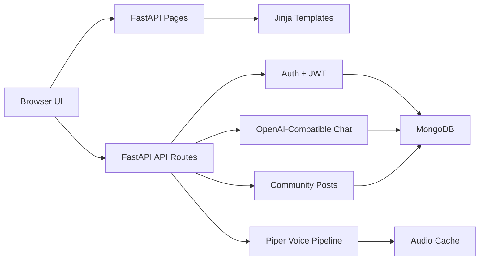

<div align="center">
  

  

  <br />
  <br />

  <a href="https://git.io/typing-svg">
    
  </a>

  <p>
    <strong>AI Companion</strong> is a full-stack FastAPI experience for personal AI chat,
    emotional reflection, anonymous community sharing, VRM companion characters, and
    local Piper-powered voice generation.
  </p>

  <p>
    
    
    
    
    
  </p>

  <p>
    <a href="#quick-start">Quick Start</a>
    |
    <a href="#companion-characters">Characters</a>
    |
    <a href="#features">Features</a>
    |
    <a href="#api-map">API Map</a>
    |
    <a href="#voice-pipeline">Voice</a>
  </p>
</div>

---

## Showcase

<div align="center">
  
  <br />
  <sub>This image is a scene preview. The real companion characters are loaded from VRM model files in the app.</sub>
</div>

## Companion Characters

GitHub cannot render `.vrm` models directly inside a README, so the character source files are listed clearly here.

| Character | VRM model | Scene assets | Role in the experience |
| --- | --- | --- | --- |
| Yuna | `app/static/images/companions/female-yuna.vrm` | `bg-yuna-cherry.jpg`, `emora-room-bg.jpg` | Warm companion for calm, reflective chats. |
| Haru | `app/static/images/companions/male-haru.vrm` | `bg-haru-forest.jpg` | Grounded companion for steady support. |
| Robert | `app/static/images/companions/robert.vrm` | `emora-room-bg.jpg` | Conversational companion for everyday guidance. |
| Rose | `app/static/images/companions/rose.vrm` | `bg-sakurada-garden.jpg` | Gentle companion for emotionally soft moments. |

## Features

| Area | What it does |
| --- | --- |
| AI chat | OpenAI-compatible chat replies with saved conversation history. |
| Dashboard | View, pin, delete, share, and continue conversations. |
| Authentication | Register, login, JWT verification, Google OAuth, and OTP password reset. |
| Community | Anonymous MongoDB-backed posts with likes. |
| Companions | VRM character models, companion profiles, scene backgrounds, and avatar assets. |
| Voice | Piper TTS integration with generated audio caching. |
| Frontend | FastAPI-served Jinja templates with custom CSS and vanilla JavaScript. |

## Architecture



## Tech Stack

```text
Backend       FastAPI, Uvicorn, Pydantic
Frontend      Jinja2, vanilla JavaScript, custom CSS
Database      MongoDB with PyMongo
AI chat       OpenAI Python SDK with compatible base URL support
Auth          JWT, bcrypt, Google OAuth, email OTP
Voice         Piper TTS, Hugging Face model downloads, WAV cache
Assets        PNG avatars, JPG scenes, VRM companion models
```

## Quick Start

Clone the repository:

```bash
git clone https://github.com/MaheshReddy-ML/AI-Companion-
cd AI-Companion-
```

Create the environment and install dependencies:

```bash
python3 -m venv .venv
source .venv/bin/activate
pip install -r requirements.txt
```

Create your local environment file:

```bash
cp .env.example .env
```

Start the app:

```bash
uvicorn app.main:app --reload --host 127.0.0.1 --port 8000
```

Open the local app:

```text
http://127.0.0.1:8000
```

## Environment Variables

| Variable | Required | Purpose |
| --- | --- | --- |
| `MONGO_URI` | Yes | MongoDB connection string. |
| `JWT_SECRET` | Yes | Secret key used to sign access tokens. |
| `OPENAI_API_KEY` | Yes | Key for OpenAI-compatible chat completions. |
| `OPENAI_BASE_URL` | Optional | Compatible API endpoint, such as GitHub Models or Azure inference. |
| `OPENAI_MODEL` | Yes | Chat model name. |
| `GOOGLE_CLIENT_ID` | Optional | Google OAuth web client ID. |
| `GOOGLE_CLIENT_SECRET` | Optional | Google OAuth callback secret. |
| `EMAIL_USER` | Optional | SMTP sender email for OTP delivery. |
| `EMAIL_PASS` | Optional | SMTP app password for OTP delivery. |

## Google OAuth

For local development, configure your Google OAuth web client with:

```text
Authorized JavaScript origin: http://127.0.0.1:8000
Authorized redirect URI:       http://127.0.0.1:8000/auth/google/callback
```

If you run the app on `localhost`, add matching `localhost:8000` entries as well.

## Voice Pipeline

Install dependencies first, then optionally download recommended open-source Piper models:

```bash
python scripts/voice_downloader.py --download
```

Voice models are stored in `models/voices/`, and generated audio is cached in `cache/audio/`. Both are ignored by git because they are local/generated assets.

```text
GET  /api/voices/list
POST /api/voices/speak
```

Example voice request:

```json
{
  "text": "Hey, I am here with you.",
  "companion_id": "Yuna",
  "voice_id": null,
  "stream": false
}
```

## API Map

| Endpoint | Method | Purpose |
| --- | --- | --- |
| `/` | `GET` | Landing page. |
| `/login` | `GET` | Login page. |
| `/register` | `GET` | Registration page. |
| `/dashboard` | `GET` | Conversation dashboard. |
| `/community` | `GET` | Anonymous community page. |
| `/health` | `GET` | Server health check. |
| `/api/auth/*` | Mixed | Registration, login, OTP, Google auth, token verification. |
| `/api/chat/*` | Mixed | Chat and conversation actions. |
| `/posts` | `GET/POST` | List or create community posts. |
| `/posts/{post_id}/like` | `POST` | Like a community post. |
| `/api/voices/list` | `GET` | List available local voices. |
| `/api/voices/speak` | `POST` | Generate companion speech audio. |

## Project Structure

```text
AI-Companion-/
  app/
    main.py                 FastAPI app entrypoint
    config.py               Environment-backed settings
    database.py             MongoDB connection and indexes
    security.py             Password hashing, JWTs, auth helpers
    routers/                Pages, auth, chat, posts, voices
    services/               OpenAI, Google auth, community logic
    templates/              Jinja HTML pages
    static/
      css/                  App styling
      js/                   Page behavior
      images/
        avatars/            PNG avatar presets
        companions/         VRM models and scene backgrounds
  scripts/
    voice_downloader.py     Piper voice model downloader
  .env.example              Safe environment template
  requirements.txt          Python dependencies
```

## Useful Commands

```bash
# Run development server
uvicorn app.main:app --reload --host 127.0.0.1 --port 8000

# Verify Python files compile
python3 -m compileall app

# Download optional voice models
python scripts/voice_downloader.py --download
```

## Roadmap

- Real-time voice streaming with timing metadata
- Richer emotional insight summaries
- More companion presets and personality controls
- Docker deployment profile
- Route-level tests for auth, chat, posts, and voice
- Rendered preview images for each VRM character

---

<div align="center">
  
  <strong>AI Companion</strong>
  <br />
  Built to make personal AI feel calmer, warmer, and more alive.
</div>
