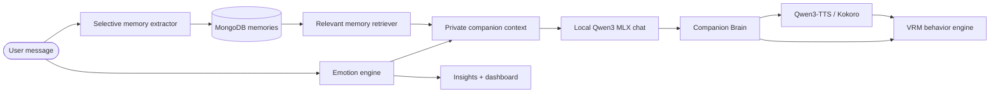

<div align="center">
  

  <br />

  <a href="#quick-start"></a>
  <a href="#verification"></a>
  <a href="docs/PRODUCTION_DEPLOYMENT.md"></a>

  <br /><br />

  <a href="https://fastapi.tiangolo.com/"></a>
  <a href="https://www.mongodb.com/"></a>
  <a href="https://www.python.org/"></a>
  
  
  

  <h1>Emora</h1>

  <p><strong>A private AI companion that remembers what matters, responds with emotional context, and feels present through voice and avatar motion.</strong></p>

  <p>
    <a href="#why-emora">Why Emora</a> ·
    <a href="#experience">Experience</a> ·
    <a href="#plans--real-access">Plans</a> ·
    <a href="#architecture">Architecture</a> ·
    <a href="#quick-start">Quick start</a> ·
    <a href="#api-map">API map</a> ·
  <a href="#trust--privacy">Trust & privacy</a>
  </p>
</div>

> [!IMPORTANT]
> Emora offers supportive conversation and reflective signals—not therapy, diagnosis, crisis care, or a replacement for real-world support.

## Why Emora

Most chatbots reset when a tab closes. Emora is designed around continuity: it keeps user-owned conversations, selectively remembers explicit details, reads the emotional shape of a message, and turns that context into a warmer response, a more natural voice, and an animated companion presence.

| The companion loop | What it means in the product |
| --- | --- |
| **Listen** | Each message receives an explainable, non-clinical emotional estimate. |
| **Remember** | Clear preferences, goals, routines, life details, and time-sensitive reminders can be saved—rather than every sentence. |
| **Respond** | Relevant private context is supplied to the AI reply, helping it follow up naturally without pretending certainty. |
| **Feel present** | The Companion Brain guides Qwen3-TTS/Kokoro voice style, VRM expression, gaze, gestures, lip sync, and thinking/listening states. |
| **Reflect** | Dashboard and insights values are generated from saved conversation activity, not hardcoded demo numbers. |

## Experience

<div align="center">
  
  <p><sub>Choose a companion, then meet them in a room built for voice, gaze, gesture, and conversation.</sub></p>
</div>

| Space | Built for |
| --- | --- |
| **Overview** | Live activity rhythm, memory count, recent threads, and gentle conversation-driven nudges. |
| **Companion** | Persistent chat, file attachments, conversation pinning/search/export, and character-specific personas. |
| **Meet Emora** | A live VRM room with auto-framing camera, speech recognition, Qwen3-TTS streaming, lip sync, and responsive motion. |
| **Insights** | Tone trends and activity for everyone, with longer Look Back ranges, Pro reflection briefs, a real-data period reflection, and a private cross-source timeline when entitled. |
| **Emora Play** | Daily quests and a private garden, plus a paid Ritual Archive, persistent World Atelier, nine real Remix transformations, and Complete voice keepsakes. |
| **Focus Together** | A dedicated Pro space for timed or open-ended invitation-only rooms, live participant presence, refresh recovery, and a shared `@emora` conversation. The transcript is cleared when the room ends. |
| **Personal space** | Journal entries, Gentle Goals, arrival check-ins, quiet hours, and user-controlled companion memories. |
| **Community** | An anonymous, moderated reflections feed with ownership-aware edit/delete controls. |

## Plans & real access

Emora keeps the existing **Free**, **Plus**, **Pro**, and **Complete** plan structure. Access is resolved on the server from the signed-in account’s active or trialing subscription; expired or canceled subscriptions safely resolve to Free without deleting retained user data. The interface mirrors those server entitlements, but sensitive endpoints enforce them independently.

| Plan | Product outcome | Working capabilities |
| --- | --- | --- |
| **Free** | Start building a private space. | Text companion, journal, Gentle Goals, daily quests and garden, community, 7/30-day insights, memory review/removal, and privacy controls. |
| **Plus** | Make Emora more personal. | Voice, longer messages and attachments, expanded companion memory, conversation export, 90-day Look Back, and a private Play Ritual Archive derived from completed quests. |
| **Pro** | Let Emora understand the bigger picture. | Everything in Plus, opt-in Adaptive Context, persistent World Atelier choices, timed or unlimited Focus Together rooms with live presence and shared `@emora` replies, nine functional Conversation Remix shapes, all-time insights, a Pro Reflection Brief, period reflection, and a personal timeline built from real conversations, arrivals, journals, goals, and memories. |
| **Complete** | Use every current Emora capability. | Everything in Pro, private Voice Keepsakes generated from an owned conversation, higher chat/TTS limits, priority local generation, and early access. |

The project does not pretend a payment succeeded when it has not. The existing billing route records a pending checkout request; subscription activation remains controlled by the configured billing/admin workflow. Owner allowlisted accounts receive administrator access through the same centralized access resolver.

### Companion signals, from message to presence



<details>
<summary><strong>What makes the avatar feel alive?</strong></summary>

The VRM stage is intentionally never a static model. It has full-body automatic camera framing, smooth model/camera settling, breathing, blinks, micro-gaze shifts, listening nods, thinking glances, posture adjustments, lip sync, hand gestures, and emotional expression mapping. The backend Companion Brain gives the stage state-aware behavior values instead of leaving it to infer everything from text.

</details>

## Architecture

```text
┌───────────────────────────────────────────────────────────────────────────────┐
│                             Browser experience                                 │
│  Jinja pages · vanilla JS · VRM/Three.js stage · Web Audio · Web Speech       │
└───────────────────────────────┬───────────────────────────────────────────────┘
                                │ HTTPS / JSON
┌───────────────────────────────▼───────────────────────────────────────────────┐
│                               FastAPI application                              │
│  Auth · Chat · Companion memory · Emotion analysis · Insights · Voice · Admin │
└───────────────┬───────────────────────────────┬───────────────────────────────┘
                │                               │
     ┌──────────▼──────────┐         ┌──────────▼────────────────────┐
     │       MongoDB        │         │     Local Qwen3 MLX chat      │
     │ users · chats ·     │         │  response + Companion Brain   │
     │ memories · posts    │         └───────────────────────────────┘
     └─────────────────────┘
                │
     ┌──────────▼────────────────────────────────────────────────────┐
     │ Local voice path: Qwen3-TTS on MLX (Apple Silicon) → Kokoro   │
     │ fallback → streamed PCM/WAV → browser analyser → avatar lip sync│
     └───────────────────────────────────────────────────────────────┘
```

### Project map

```text
app/
├── companion.py                 # Emotion, memory, relationship, dashboard logic
├── companion_brain.py           # Response behavior and speech metadata
├── database.py                  # MongoDB access, indexes, serialization
├── voice_manager.py             # Qwen3-TTS / Kokoro voice orchestration
├── routers/
│   ├── api_auth.py              # Account, JWT, OAuth, OTP, avatars
│   ├── api_chat.py              # Persistent conversations and attachments
│   ├── companion.py             # Memory controls + dynamic dashboard API
│   ├── insights.py              # Reflection data
│   ├── voices.py                # Voice listing and synthesis
│   ├── posts.py                 # Anonymous community
│   └── admin.py                 # Protected diagnostics
├── services/                    # Chat, memory, attachment, OAuth, post services
├── static/                      # CSS, JS, companion artwork, VRM assets
└── templates/                   # Server-rendered application pages
```

## Quick start

### 1. Create and activate an environment

```bash
python3 -m venv .venv
source .venv/bin/activate
```

<details>
<summary>Windows PowerShell</summary>

```powershell
py -m venv .venv
.\venv\Scripts\Activate.ps1
```

</details>

### 2. Install dependencies

```bash
python -m pip install --upgrade pip
python -m pip install -r requirements.txt
```

### 3. Add local configuration

```bash
cp .env.example .env
```

Set these first:

```env
JWT_SECRET=replace-with-a-long-random-secret
MONGO_URI=mongodb://127.0.0.1:27017/ai-companion-fastapi
CHAT_MLX_MODEL=Qwen/Qwen3-4B-MLX-4bit
```

### 4. Start MongoDB

Use an existing local/managed MongoDB instance, or start one with Docker:

```bash
docker run --name emora-mongo -p 27017:27017 -d mongo:7
```

### 5. Run Emora

```bash
python -m uvicorn app.main:app --reload --host 127.0.0.1 --port 8000
```

Open **[http://127.0.0.1:8000](http://127.0.0.1:8000)** and create an account.

### Optional: warm the local voice model (Apple Silicon)

```bash
python3 scripts/tts_setup.py --warmup
python3 scripts/benchmark_tts.py
```

### Benchmark a local chat candidate

Run the configured model first, then explicitly compare another compatible MLX
checkpoint only when you are ready for its download and memory cost:

```bash
../.venv/bin/python scripts/benchmark_chat.py
../.venv/bin/python scripts/benchmark_chat.py --model <mlx-model-id> --output CHAT_BENCHMARK_candidate.json
```

The report separates the first request (which includes model loading) from
warm requests and records peak process RSS, visible response throughput, and
behavior outputs for casual, celebratory, explanatory, and goodbye scenarios.
It does not claim tokenizer-level tokens/sec because that MLX-LM API does not
provide those timings.

See [the security and runtime audit](docs/SECURITY_AND_RUNTIME_AUDIT.md) for
the dependency-install policy, shared-environment isolation finding, and the
full model-selection protocol.

Qwen3-TTS through MLX-Audio is the primary local runtime on Apple Silicon. Kokoro remains an automatic fallback. See [VOICE_PIPELINE_README.md](VOICE_PIPELINE_README.md) for streaming behavior, voices, pronunciation controls, and benchmarks.

### Local Qwen chat (Apple Silicon)

Chat runs locally through `Qwen/Qwen3-4B-MLX-4bit` on Apple Silicon and never needs an API key. The first request downloads the model into the Hugging Face cache (if needed) and loads it once; later requests reuse the in-memory model. After a server restart, MLX reloads from that local cache rather than downloading again. See [the model-selection record](docs/MODEL_SELECTION.md) for the measured 1.7B-to-4B decision.

### Optional local camera check-ins

In Chat with Emora or Meet Emora, select the camera button and grant browser permission only when comfortable. Emora captures one reduced-size frame only when you send a message, analyzes it locally with the 4-bit MLX `Qwen2-VL-2B` model, and uses only coarse momentary expression/attention cues to adapt its reply. It never stores camera frames, video, identity data, demographic guesses, medical conclusions, or diagnoses. Each chat saves a short behavior report based on the words shared and, when enabled, that optional visual check-in; the aggregate appears in Insights.

The vision model downloads on the first camera check-in and is kept in the Hugging Face cache. Set `VISION_MLX_MODEL` to use another compatible MLX-VLM checkpoint.

## Configuration

Copy `.env.example`; it documents every available setting. These are the settings most projects need to review:

| Area | Variables | Notes |
| --- | --- | --- |
| **Core** | `APP_NAME`, `APP_ENV`, `HOST`, `PORT` | Keep `APP_ENV=production` in deployed environments. |
| **Security** | `JWT_SECRET`, `JWT_ALGORITHM`, `ACCESS_TOKEN_EXPIRE_DAYS`, `ADMIN_API_KEY` | Use a strong unique secret; only enable diagnostics deliberately. |
| **Database** | `MONGO_URI`, `MONGO_SERVER_SELECTION_TIMEOUT_MS` | A Mongo database is required for accounts, chat, memory, and community data. |
| **Chat** | `CHAT_MLX_MODEL`, `CHAT_MLX_MAX_TOKENS`, `CHAT_MLX_TEMPERATURE`, `CHAT_MLX_THINKING_MODE` | Local Qwen3 MLX chat on Apple Silicon; `auto` keeps casual turns direct and reserves private reasoning for complex requests. |
| **Developer telemetry** | `COMPANION_DEBUG` | Opt-in local Brain/render/request telemetry; always disabled in production. |
| **Optional camera** | `VISION_MLX_MODEL`, `VISION_MLX_MAX_TOKENS` | Local-only MLX-VLM check-ins; image pixels are never persisted. |
| **Voice** | `TTS_ENGINE`, `TTS_QWEN_MODEL`, `TTS_WORKER_COUNT`, `TTS_QUEUE_MAX_PENDING`, `TTS_PRONUNCIATION_DICTIONARY` | The default engine is `qwen3-mlx`; set `kokoro` to force the fallback. |
| **Google OAuth** | `GOOGLE_CLIENT_ID`, `GOOGLE_CLIENT_SECRET`, `GOOGLE_CALLBACK_URL` | Configure the same callback URL with Google. |
| **Email / OTP** | `EMAIL_HOST`, `EMAIL_PORT`, `EMAIL_USER`, `EMAIL_PASS`, `EMAIL_FROM_NAME` | Required when password-reset email is enabled. |
| **Owner access** | `ADMIN_EMAILS`, `ADMIN_API_KEY` | Comma-separated owner allowlist receives administrator/full-plan access; the key remains available for diagnostics automation. Owner addresses cannot be claimed through unverified local registration. |

<details>
<summary><strong>Google OAuth local callback</strong></summary>

For a local web client, add one of the following to the Google OAuth configuration:

| Setting | `127.0.0.1` value | `localhost` value |
| --- | --- | --- |
| Authorized JavaScript origin | `http://127.0.0.1:8000` | `http://localhost:8000` |
| Authorized redirect URI | `http://127.0.0.1:8000/auth/google/callback` | `http://localhost:8000/auth/google/callback` |

</details>

## API map

All account-scoped endpoints require `Authorization: Bearer <token>` unless noted otherwise.

| Domain | Method | Endpoint | Purpose |
| --- | --- | --- | --- |
| Health | `GET` | `/health` | Lightweight liveness check. |
| Health | `GET` | `/health/ready` | Database/integration readiness status. |
| Auth | `POST` | `/api/auth/register` | Create a local account. |
| Auth | `POST` | `/api/auth/login` | Start a JWT session. |
| Auth | `POST` | `/api/auth/logout` | Invalidate the current token generation. |
| Chat | `GET` | `/api/chat?page=&limit=&search=&pinned=` | Browse persistent conversations. |
| Chat | `POST` | `/api/chat` | Save a user message and companion response. |
| Chat | `GET` | `/api/chat/conversations/{id}/export?format=json\|text` | Export an owned conversation. |
| Memory | `GET` | `/api/companion/memories` | Review saved, non-expired memories. |
| Memory | `DELETE` | `/api/companion/memories/{memory_id}` | Remove one owned memory. |
| Companion | `GET` | `/api/companion/dashboard` | Read conversation-derived companion metrics. |
| Insights | `GET` | `/api/insights?days=30` | Read reflective timeline and mood data. |
| Emora Play | `GET` | `/api/play/ritual-history` | Read the Plus private ritual archive. |
| Emora Play | `PUT` | `/api/play/space` | Persist a Pro World Atelier backdrop, ambience, and accessory. |
| Emora Play | `POST` | `/api/play/remix` | Run one of the entitlement-protected Remix transformations. |
| Emora Play | `GET` | `/api/play/postcard/{conversation_id}` | Generate a Complete voice keepsake from an owned conversation. |
| Focus Together | `POST` | `/api/play/focus-rooms` | Create a timed or unlimited, invitation-only Pro focus room. |
| Focus Together | `POST` | `/api/play/focus-rooms/join` | Join an active focus room using its private code. |
| Focus Together | `GET` | `/api/play/focus-rooms/current` | Restore the signed-in member’s active room after refresh. |
| Focus Together | `GET` | `/api/play/focus-rooms/{code}` | Read authoritative room state, active participants, and shared transcript. |
| Focus Together | `GET` | `/api/play/focus-rooms/{code}/events` | Subscribe to the authenticated room-scoped server event stream. |
| Focus Together | `POST` | `/api/play/focus-rooms/{code}/messages` | Add a shared message; an `@emora` mention also creates a room-visible Emora reply. |
| Focus Together | `POST` | `/api/play/focus-rooms/{code}/end` | End an active room (host only) and clear its conversation. |
| Focus Together | `POST` | `/api/play/focus-rooms/{code}/leave` | Remove one client connection from room presence. |
| Voice | `GET` / `POST` | `/api/voices/list` · `/api/voices/speak` | List voices or generate speech. |
| Community | `GET` / `POST` | `/posts` | Browse or create anonymous reflections. |
| Billing | `GET` | `/api/billing/plans` | Public Free, Plus, Pro, and Complete plan catalog. |
| Billing | `GET` / `POST` | `/api/billing/access` · `/api/billing/checkout` | Read effective entitlements or create a pending verified-checkout request. |
| Billing admin | `GET` / `PATCH` | `/api/billing/admin/users` · `/api/billing/admin/users/{id}/subscription` | Owner-only account and subscription management. |
| Admin | `GET` | `/api/admin/diagnostics` | Protected diagnostics; send `X-Admin-Key` or use an owner account token. |

### A few useful requests

<details>
<summary>Search conversations</summary>

```bash
curl "http://127.0.0.1:8000/api/chat?search=deadline&limit=20" \
  -H "Authorization: Bearer <your_token>"
```

</details>

<details>
<summary>Generate a streamed companion voice reply</summary>

```bash
curl -X POST http://127.0.0.1:8000/api/voices/speak \
  -H "Authorization: Bearer <your_token>" \
  -H "Content-Type: application/json" \
  -d '{"text":"I hear you. Let us slow this down for a second.","character_id":"yuna","stream":true}'
```

</details>

<details>
<summary>Check deployment readiness</summary>

```bash
curl http://127.0.0.1:8000/health/ready
```

</details>

## Trust & privacy

Emora is built around user control rather than the illusion of perfect recall.

- Passwords use bcrypt hashing with a SHA-256 pre-hash; reset OTPs are hashed before storage.
- JWTs include expiration and token versions. Password resets and logout revoke older sessions.
- High-risk endpoints are rate limited, attachments validate file type/signature, and admin diagnostics require a separate key.
- Paid access is resolved on the server from active subscription state. The checkout preview stores no card or UPI details and creates only a pending request until a billing provider or administrator verifies access.
- The companion stores only clear, useful facts; temporary reminders expire after 28 days.
- Memory, conversations, attachments, account exports, and deletion actions are authenticated and scoped to the account owner.
- Community identities remain server-side; clients receive no profile identity for anonymous posts.
- Dashboard and insights are reflective estimates from voluntarily shared text—not medical, psychological, or social-scoring systems.

## Verification

```bash
python3 -m compileall app tests
python3 -m pytest -q
```

The test suite covers core companion logic, memory/emotion behavior, schemas, OTP hashing, attachment validation, post moderation flows, public-page/static-asset smoke tests, protected diagnostics, and optional Mongo integration coverage. CI runs the same compile and test gates using MongoDB 7.

## Production

For deployment, follow the complete [production guide](docs/PRODUCTION_DEPLOYMENT.md). At minimum:

- run behind HTTPS;
- use a managed or secured MongoDB deployment;
- set a strong `JWT_SECRET` and keep `.env` out of source control;
- retain `RATE_LIMIT_ENABLED=true`;
- warm the TTS model during deployment when using local voice;
- review `needs_review` community posts and audit events; and
- use `/health` and `/health/ready` in platform checks.

## Documentation & project notes

| Resource | What it covers |
| --- | --- |
| [Voice pipeline](VOICE_PIPELINE_README.md) | Qwen3-TTS/MLX setup, Kokoro fallback, streaming, pronunciation, and benchmarks. |
| [VRM diagnostics](docs/VRM_RENDERING_DIAGNOSTICS.md) | Avatar rendering and camera troubleshooting. |
| [Production deployment](docs/PRODUCTION_DEPLOYMENT.md) | Environment, security, MongoDB, operations, and deployment checklist. |
| [Companion upgrade report](COMPANION_UPGRADE_IMPLEMENTED_2026-07-15.txt) | Selective memory, emotion engine, dynamic dashboard, and relationship work. |
| [TTS upgrade report](TTS_UPGRADE_IMPLEMENTED_2026-07-15.txt) | Local streaming voice upgrade record. |

## Contributing

The best contribution is one that protects the companion experience: keep changes modular, avoid sending secrets or user data to logs, preserve user ownership checks, and add/extend tests with every behavioral change.

## License

No license file is currently included. Add an explicit license before publishing or distributing the project.
